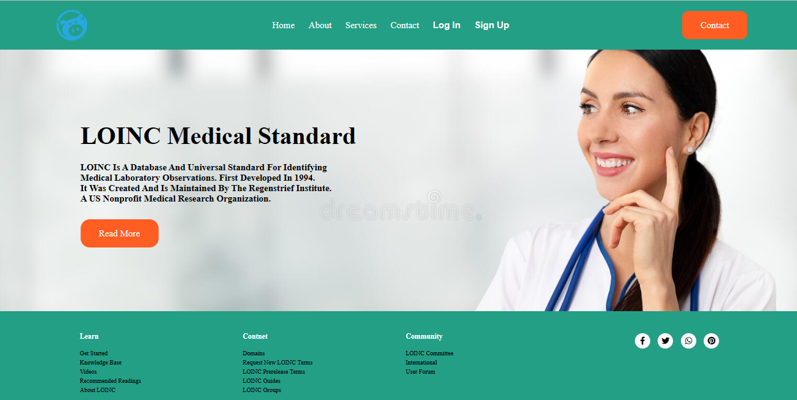
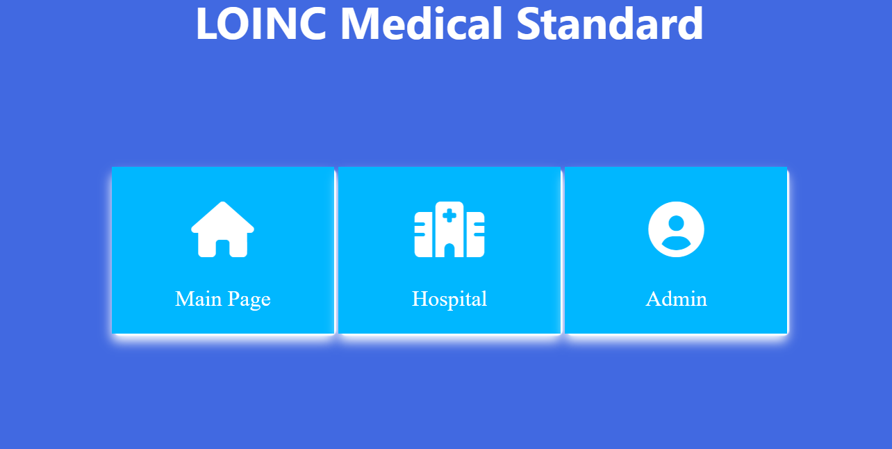
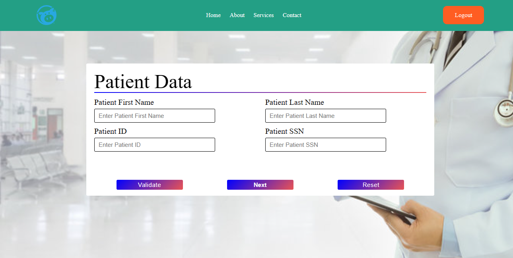
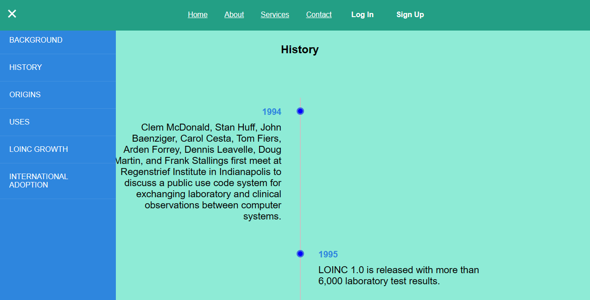
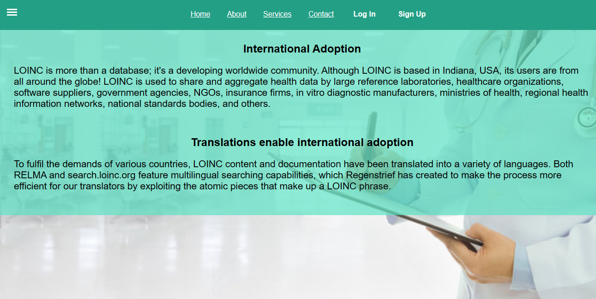

# Loinc-Medical-Standard-Static-Website
Welcome to my project on GitHub! This is a static website built using HTML and CSS, focusing on the LOINC medical standard. The website provides a platform where patients and doctors can log in, with doctors being able to input laboratory results for patients. Patients can access their results by logging in with their username and password
## Table of Contents

- [Built with](#Built-with)
- [Design](#Design)
- [Acknowledgements](#Acknowledgements)

## Built with

## Design

## Acknowledgements

Submitted to: Dr. Ahmed Hisham & Eng. Sohaila Mohammed

All rights reserved © 2022 to Team 10 - HealthCare Engineering and Management, Cairo University (Class 2025)
